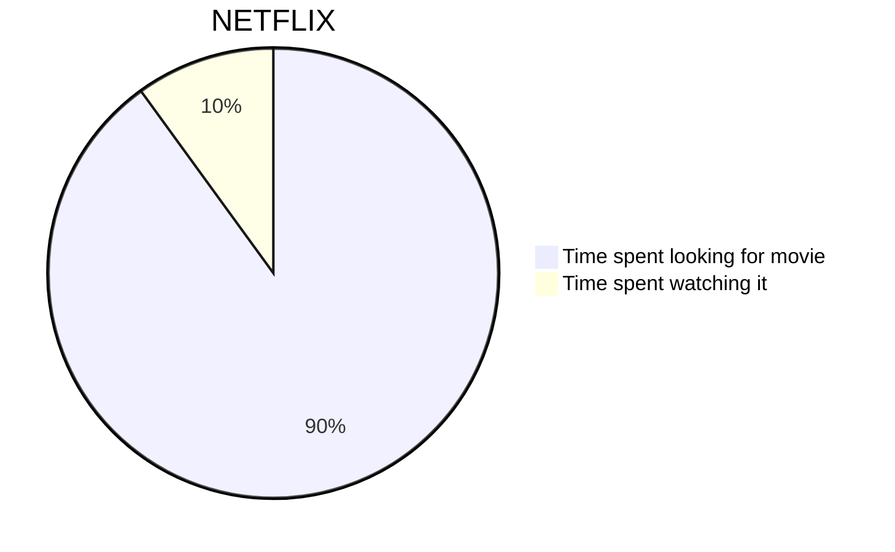
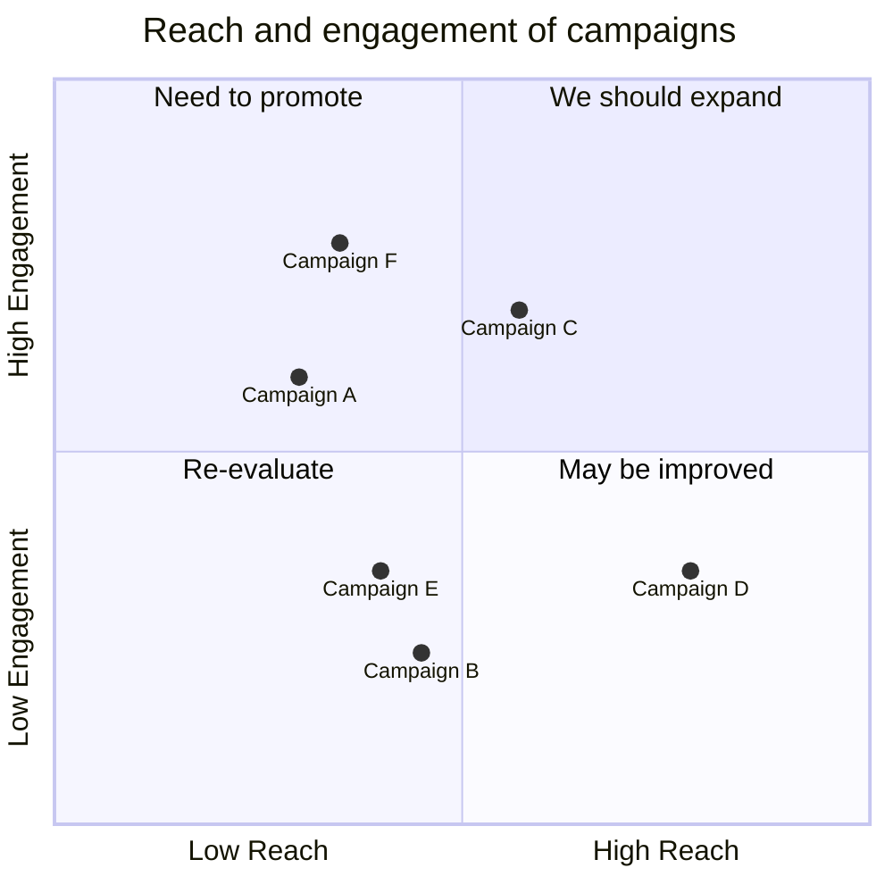

---
{"dg-publish":true,"permalink":"/digital-garden/format-test/","noteIcon":"1","created":"2025-04-06T12:34:01.156-04:00","updated":"2025-04-06T12:49:47.601-04:00"}
---

This Page isn't really meant as a reference for anything other than how the given theme renders the Standard MD inputs. I'll occasionally play with the Theme and this is an easy page to visually see how that change affects all of my formatting. 
# H1
## H2
### H3
#### H4
##### H5
###### H6

**This is Bold text**

*This is Italic*

~~Strikethrough~~

<u>Underlined</u>

====Highlighted====

`Single Block`

``` js
<script> 
Test Script
</script>

```




- Item 1
- Item 2
- Item3 

1. Item 1
2. Item 2
3. Item 3

- [ ] CheckBox
- [x] CheckBox

$$\pi\frac{e^{2}}{\tan(y)}$$

> [!Please Note] 
> This is a note 

> [!example] 
> Example Note for things
> 

